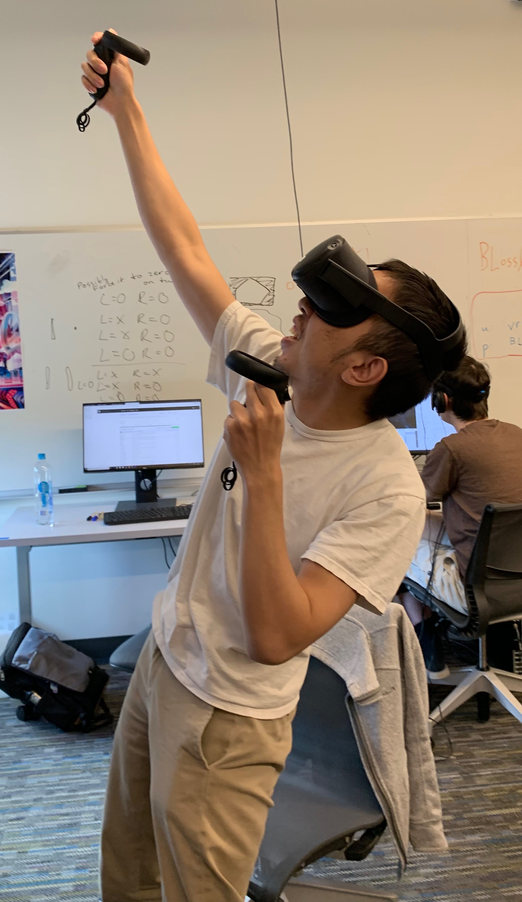

## What Everyone Did
* A.J: Helped polish Quest graphics, added more UI elements for player guidance/ease of play (skip puzzle button, show hint), added more fun effects and assets, implemented better haptics for the Fantasia moment.

* P.J: Put boid simulation onto the GPU, test some shader effects, make radial puzzle better, make project more cross platform

* Ben:  

* Hannah: Made puzzle visuals sync to Fantasia section when music starts and stops, logo fade-in at end, start putting together melody puzzle

## Code Update
* The team has been working hard to finish smoothing everything out, sync puzzles to our better audio, add more interactions, and finalize all puzzles. We've also ben trying to increase our game's performance and get everything moved to the Quest.

Links to Examples of Added Code:
* [Improved Flocking](https://github.com/UWRealityLab/vrcapstone19sp-team7/tree/master/PhantasiaConductor/Assets/Scripts/Boids)
* [Melody Puzzle](https://github.com/UWRealityLab/vrcapstone19sp-team7/tree/master/PhantasiaConductor/Assets/Scripts/MelodyPuzzle.cs)
* [Cross-Platform](https://github.com/UWRealityLab/vrcapstone19sp-team7/tree/master/PhantasiaConductor/Assets/Scripts/CrossPlatform)

## Idea Update
* We are having the batons serve as a progress indicator. They will "fill up" to indicate puzzle progress.

* Quest graphics won't have any glow effect (lack of HDR support on the hardware)

* We will have a skip puzzle button on the controllers to allow people to skip a puzzle if they are stuck. We also want to have a button that will show the hint for that puzzle again.

We are now officially cross-platform!:

## Plan for Next Week

* Have our project finalized and git code submitted by Monday!
* Finish the video and poster
* Ensure our executable versions work on both the Quest and WMR platform

Here is what everyone will do:

P.J: 
* More shaders, more radial puzzle stuff (match to music better), particles, complete oculus fork, more fantasia effects.

Ben:
* 
* 

A.J:
* Polish graphics, effects, haptics
* Ensure blog, website, video script, and poster are all done

Hannah:
* Finish melody puzzle 
* Add more effects to fantasia section 

## Blocking Issues
* Audio syncing with an actual music piece is even more challenging than just with simple midi instrument files, which has complicated our workflow slightly
* Designing a cross-platform project has come with some unique challenges that we are tackling by trying to reference more generalized prefabs/scripts that then take care of proper package assignment (OVR versus SteamVR)
